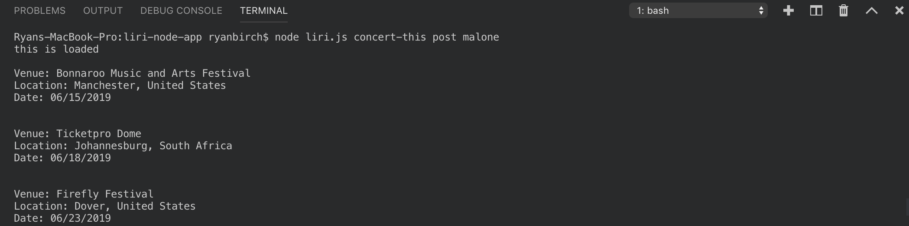
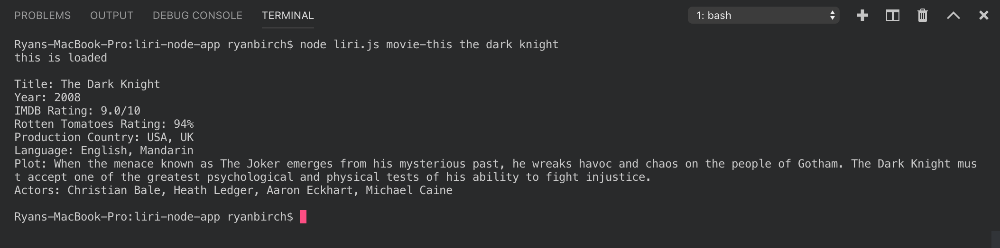
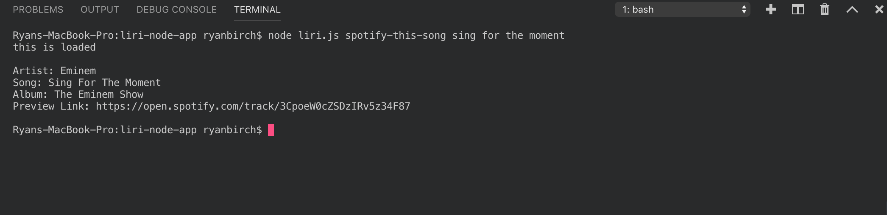

# liri-node-app

## Overview
This is a command line node.js app where the user can request data from different apis. You can request concert data from the bands in town api, movie data from the omdb api, or music data from the spotify node api. Commands can be taken in either directly through the command line, or through a text file.

## To request concert data: 
> node liri.js concert-this [name of artist]

### Example:  
 
  

## To request movie data: 
> node liri.js movie-this [name of movie]

### Example: 
    

### If no movie is specified, it will default to 'Mr. Nobody'
 
  

## To request song data: 
> node liri.js spotify-this-song [name of song]

### Example: 
 

### If no song is specified, it will default to 'The Sign' by Ace of Base
 
  

## Alternatively, you can give commands through a text file: 
> node liri.js do-what-it-says
### do-what-it-says, concert-this
 
### do-what-it-says, movie-this
 
### do-what-it-says, spotify-this-song
 